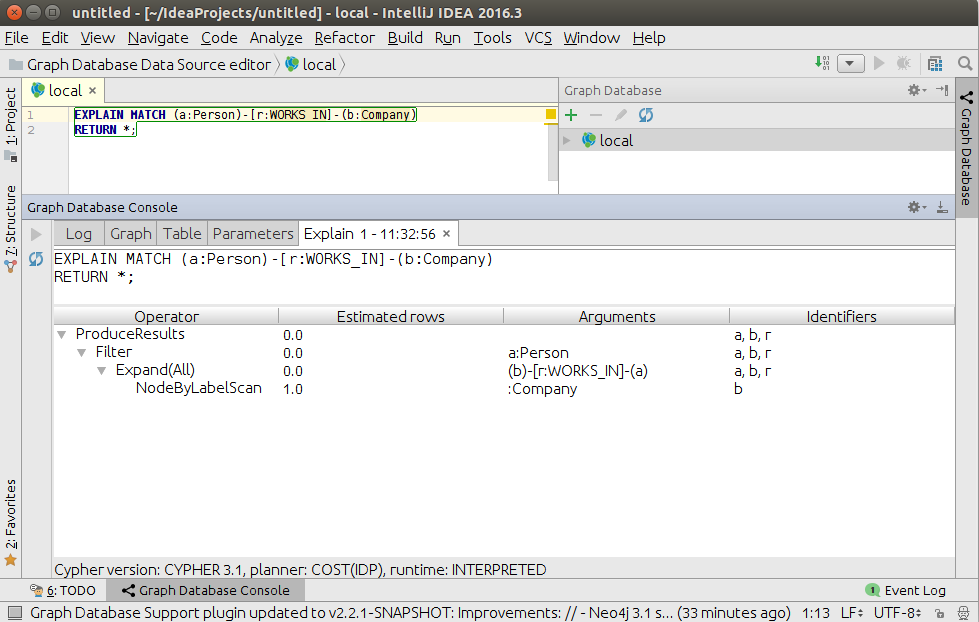
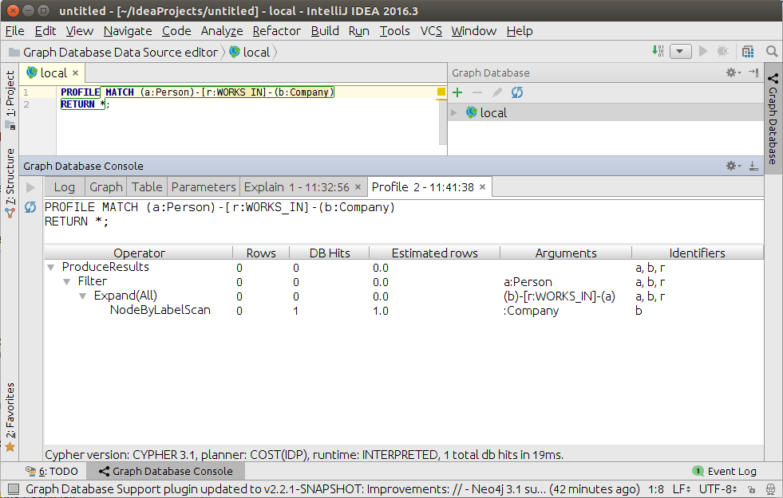

# Console - Plan

When any `EXPLAIN` or `PROFILE` queries are executed, plugin creates a closeable tab in console, which contains the plan
of query, rendered as tree table.
 

The plan tab consists of label with an executed query, tree table with plan and label with metadata.
Note, that `PROFILE` plan table has more columns, because the query is actually executed.

