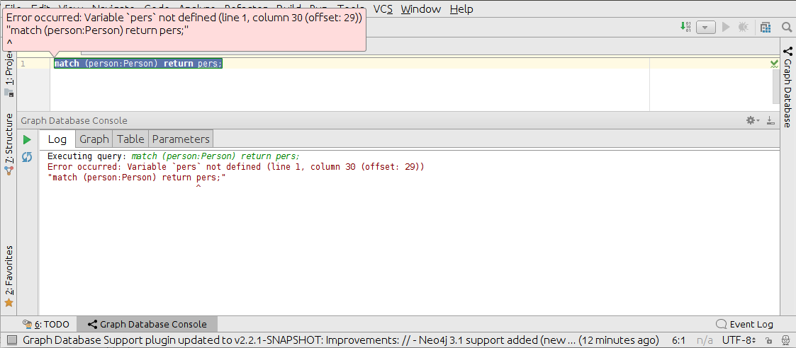
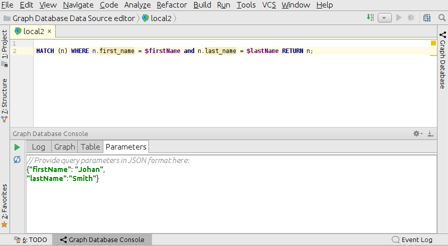

# Cypher

## Execution

Queries can be executed either for Cypher file (in this case data source selection is required), 
or from data source editor.
To open data source editor, right click on data source and choose `Open editor`.

Keyboard shortcut for query execution is *Ctrl + Enter* with the cursor on the query.
Alternatively right click on the query statement, select `Graph Database` -> `Execute Query`. 

If query execution fails, an error hint is displayed. 
 

The hint disappears as soon as any user interaction like mouse movement takes place.
Afterwards it is possible to view the error details in `Log` tab.

If parameters are needed for query execution, they can be provided in `Paramters` tab in JSON format.
For instance, for query `MATCH (n) WHERE n.name = $name RETURN n`,
parameter could look like `{"name": "Johan"}`.

`Log` tab displays, what parameters where used for query execution.

<!--
General information
File type support
-->
