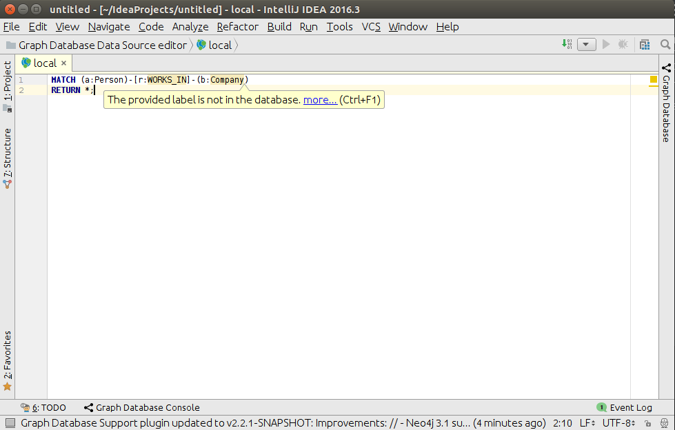

# Cypher - Inspection

### EXPLAIN warnings

Graph database plugin provides a functionality to automatically find any problems with your queries, 
using `EXPLAIN` queries. Then, all database notifications are displayed as warnings, highlighting problematic parts of
query.

Under the hood, IntelliJ platform launches inspection for a query without syntax errors, inspection prepends to the 
query an `EXPLAIN` keyword and executes it against the active data-source silently. 
After all results have been received, database notifications are displayed as warnings.

Inspection is enabled by default, but you can disable it at any time.