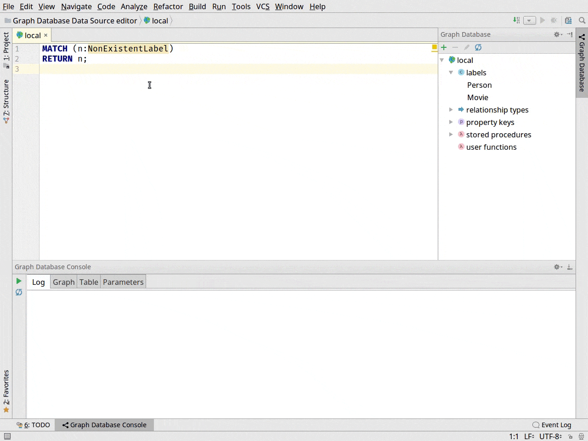

# Release 2.3.0

### Overview

New:
* Initial support for Cypher query parameters
* Support for Cypher query EXPLAIN and PROFILE analysis
* Cypher inspection: analyse queries using EXPLAIN

Improvements:
* Query database for specific label, relationship type or property via context menu
* Show error popup if query execution fails

Bugfixes:
* Variable refactoring in Cypher is now performed in single query, rather than whole file
* Syntax errors are now visible if query is highlighted with green border
* Fixed canvas background in Graph view for Darcula theme

### New

#### Cypher query parameters

Support for Cypher query parameters has arrived!

To access this functionality open `Graph Database Console` and go to `Parameters` tab.
There you can find editor where you can specify desired parameters,
that will be automatically picked up on query execution and passed to a database.

#### Explore `EXPLAIN` and `PROFILE` result

If you will try to analyse query using `EXPLAIN` or `PROFILE` keywords you will
see a new tab created in `Graph Database Console` with analysis result.

Tab contains:
* Query that was executed
* Query execution plan in a tree format
* Information about Cypher planner, runtime and execution time

#### Inspection - Analyse query using `EXPLAIN`

Cypher queries now will be automatically analysed using `EXPLAIN`.

In order to make this work you need to:
* Write queries in Data Source editor
* Have Neo4j running for this data source

